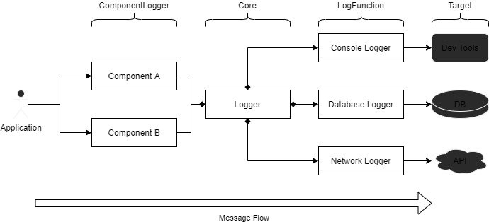

<p align="center">

</p>

# @fliegwerk/logsemts - A modular, semantic logger written in TypeScript

[npm package](https://npmjs.com/package/@fliegwerk/logsemts)
| [Library Documentation](https://fliegwerk.github.io/logsemts)
| 
| 
| 
| [](https://coveralls.io/github/fliegwerk/logsemts?branch=master)
[](https://openbase.io/js/@fliegwerk/logsemts?utm_source=embedded&utm_medium=badge&utm_campaign=rate-badge)

A modular, color-coded, TypeScript-based semantic logger that can be used in NodeJS, the browser and in many other scenarios.

## Example

```ts
// Import the logger:
import Logger, { BrowserLogger } from '@fliegwerk/logsemts';

// Create a new logger
const logger = new Logger({
	loggers: [BrowserLogger()] // that exclusively outputs to the browser dev tools
});

// get a new subsystem logger for the API Client
const apiClientLogger = logger.getComponentLogger('API Client');

// log a success message
apiClientLogger.success('Data fetched successfully');
```

## Installation

```shell script
$ npm install @fliegwerk/logsemts
```

or

```shell script
$ yarn add @fliegwerk/logsemts
```

## Concept



There are three primary components in logsemts:

- _Component Loggers_: Logger objects for specific subsystems (for example, an API connector and a login form).
  These objects contain functions like `.log()`, `.debug()`, `.warn()`, etc. to log messages regarding this subsystem.
- _Log Functions_: Functions that log a message to a specific target. Targets could be the Browser's Developer tools, a
  Database and an API.
- _Core_: The library's core consists of the `Logger` class. Usually, only one instance of that class gets used in an
  application. It manages the different components (_Component Loggers_ get created using the
  `logger.getComponentLogger(name)` function) and _Log Functions_. It also forwards the messages from the _Component
  Loggers_ to the registered _Log Functions_.
